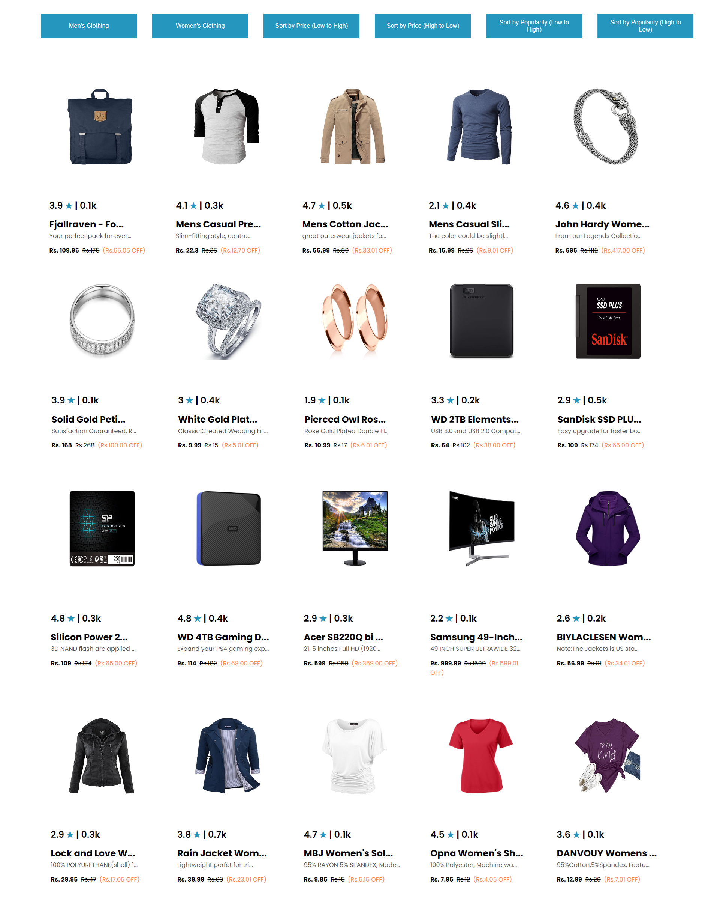

The "Product Listings" project is a web application aimed at showcasing a variety of products, primarily focusing on men's and women's clothing and electronic items. It provides users with an intuitive interface to browse through different product categories, view product details, and apply sorting options based on price and popularity.

# Key Features:

Dynamic Rendering: Utilizes JavaScript to dynamically render product cards based on provided data.
Filtering: Allows users to filter products by category, including options for men's clothing, women's clothing, and electronics.
Sorting: Enables sorting of products by price (both ascending and descending) and popularity (based on user ratings).
Responsive Design: Ensures a seamless user experience across various devices with responsive design principles.
Technologies Used:

HTML5 | CSS3 (including Flexbox for layout) | JavaScript (ES6+)

# How to Use:

Clone the repository to your local machine.
Open the index.html file in a web browser to launch the application.
Browse through different product categories using the provided buttons.
Apply sorting options to reorder the product listings based on your preferences.
Contributing:
Contributions are welcome! If you have any ideas for improvements or feature enhancements, feel free to submit a pull request.

# License:
This project is licensed under the MIT License. See the LICENSE file for more details.

# Author:
Abhijit Gadakh - gadakhabhijit@gmail.com

# Acknowledgments:
Fonts: "Fjalla One" and "Poppins" from Google Fonts.
